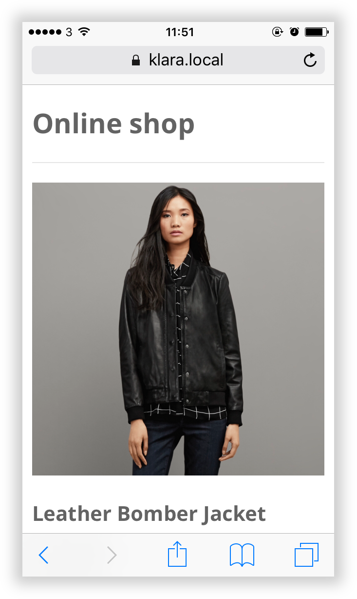
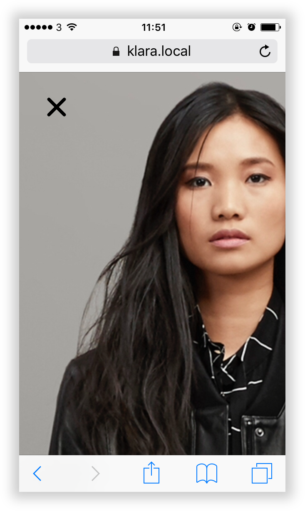
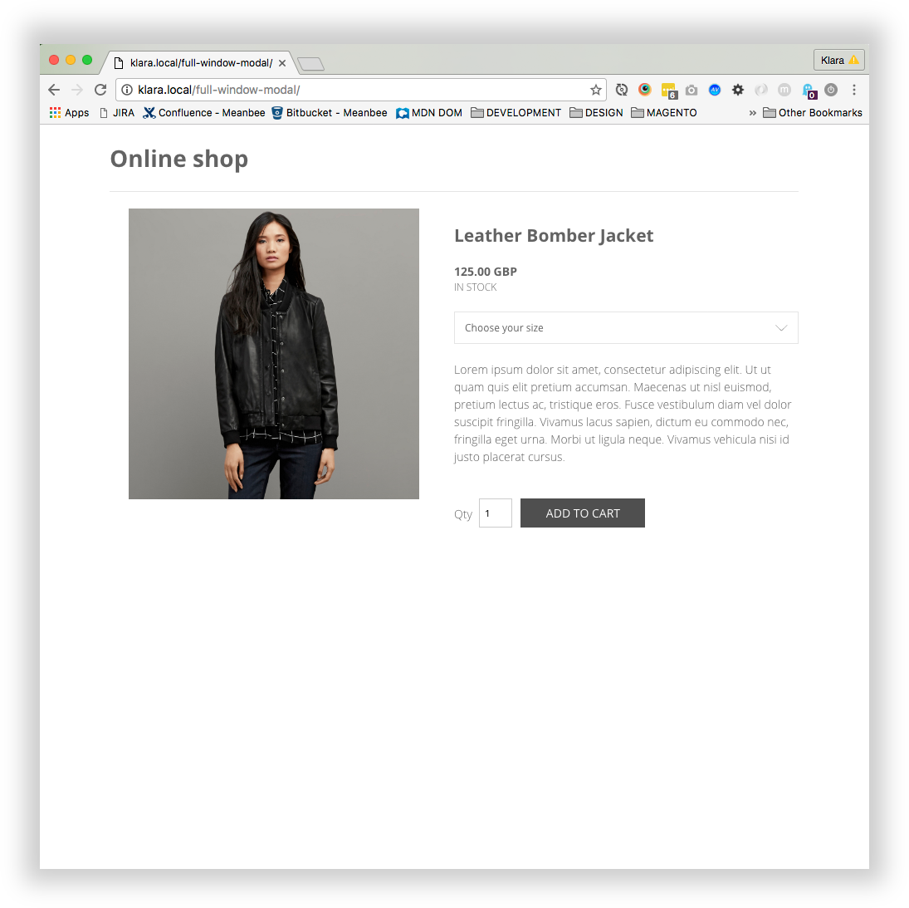
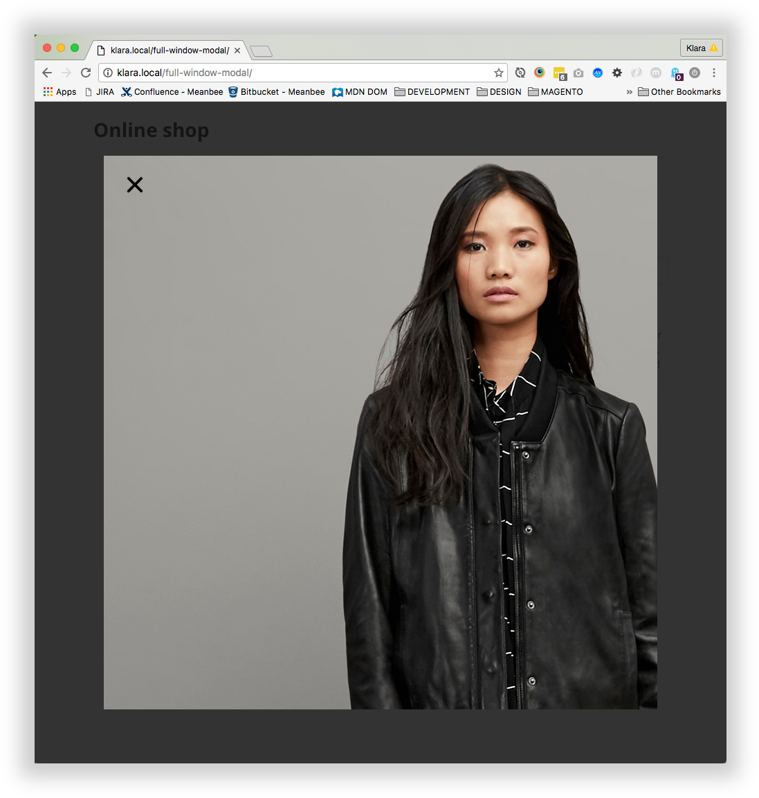

# Full window modal

Responsive full window modal


## SASS

SASS in this project is compiled with npm scripts by running ```npm run build:css```


## Demo

Full window modal is used on mobile devices and triggered by clicking the image itself.

Window modal closed on mobile: 



Window modal opened on mobile:



Window modal closed on dektop: 



Window modal opened on dektop:




This version is using scrollable modal on desktop as well, but feel free to adjust it to your needs.
